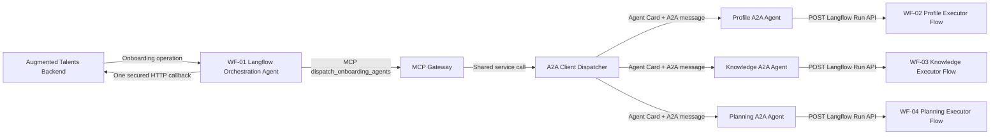

# A2A Onboarding Service for ABA Fusion / Langflow

A complete A2A 1.0 façade for the Adaptive Multi-Agent Onboarding project.

The executor intelligence stays in three ABA Fusion/Langflow flows:

- Employee Onboarding Profile Agent
- Company Onboarding Knowledge Agent
- Adaptive Onboarding Planning Agent

The external Python service supplies what Langflow 1.7.x does not natively provide as a full remote-agent protocol runtime:

- public Agent Cards
- A2A HTTP+JSON endpoints
- skill discovery and verification
- A2A messages and structured data parts
- durable tasks and lifecycle states
- artifacts
- task retrieval and cancellation
- transport authentication
- a Langflow Run API adapter
- a typed MCP gateway for the Langflow Orchestrator
- a high-level REST dispatcher endpoint for tests and non-MCP clients

## 1. Architecture



All three logical A2A agents can run in one FastAPI process. They still have distinct identities, Agent Cards, skills, A2A routes, executor mappings, and task tables.

See [docs/architecture.md](docs/architecture.md) for the responsibility split.

## 2. Agent roles and advertised skills

### Profile Agent

Agent Card:

```text
GET /agents/profile/.well-known/agent-card.json
```

A2A base URL:

```text
/agents/profile
```

Skills:

- `get_employee_onboarding_profile`
- `assess_profile_completeness`
- `identify_onboarding_constraints`

Langflow responsibility:

- retrieve authorized employee and organizational context
- normalize role, department, manager, work mode, location, start date, skills, education, experience, certifications, and languages
- identify missing profile information
- identify employee-specific onboarding constraints
- never generate the plan

### Knowledge Agent

Agent Card:

```text
GET /agents/knowledge/.well-known/agent-card.json
```

Skills:

- `search_onboarding_knowledge`
- `answer_onboarding_question`
- `get_role_onboarding_requirements`

Langflow responsibility:

- RAG over approved company onboarding documents
- policy and procedure retrieval
- mandatory training and role requirements
- tools, contacts, security, and compliance guidance
- citations, evidence, confidence, and unresolved gaps
- never invent a policy or generate the plan

### Planning Agent

Agent Card:

```text
GET /agents/planning/.well-known/agent-card.json
```

Skills:

- `generate_onboarding_plan`
- `revise_onboarding_plan`
- `adapt_onboarding_plan`
- `explain_onboarding_plan`

Langflow responsibility:

- generate a new plan from verified Profile and Knowledge artifacts
- revise a plan from explicit feedback
- adapt active/future tasks from progress and changed conditions
- explain plan decisions
- preserve completed history during adaptation

## 3. A2A endpoints

Each mounted agent exposes the A2A 1.0 HTTP+JSON routes created by the official SDK.

For `profile`, replace the prefix with `knowledge` or `planning` for the other agents.

| Purpose | Method and route |
|---|---|
| Discover Agent Card | `GET /agents/profile/.well-known/agent-card.json` |
| Send A2A message | `POST /agents/profile/message:send` |
| Stream A2A message | `POST /agents/profile/message:stream` |
| Get task | `GET /agents/profile/tasks/{task_id}` |
| List tasks | `GET /agents/profile/tasks` |
| Cancel task | `POST /agents/profile/tasks/{task_id}:cancel` |
| Subscribe to task | `GET` or `POST /agents/profile/tasks/{task_id}:subscribe` |

This project advertises `streaming=false` and does not configure push notifications for the MVP. The route factory can expose standard routes even when a capability is not advertised; callers must respect the Agent Card. The pinned SDK exposes both `GET` and `POST` for task subscription; the A2A specification defines `GET`.

## 4. MCP gateway and REST dispatcher

The Orchestration Agent should connect to the Streamable HTTP MCP endpoint:

```text
https://YOUR-A2A-SERVICE/mcp
```

It discovers one typed tool:

```text
dispatch_onboarding_agents(mode, calls)
```

The MCP gateway validates the typed arguments and calls the existing dispatcher service directly. The dispatcher is a convenience façade, not a replacement for A2A. Internally it:

1. fetches the target Agent Card;
2. verifies that the requested skill is advertised;
3. selects the `HTTP+JSON` interface;
4. creates an A2A `Message` with a structured data `Part`;
5. submits a `SendMessageRequest`;
6. tracks the returned task state;
7. extracts the final artifact;
8. returns a normalized result to the Langflow Supervisor.

It supports actual concurrent calls:

```json
{
  "mode": "parallel",
  "calls": []
}
```

and ordered calls:

```json
{
  "mode": "series",
  "calls": []
}
```

Use `parallel` for independent Profile and Knowledge calls. Call Planning only after required upstream artifacts are available.

Long-running dispatches are resumable. If agent work exceeds `DISPATCH_WAIT_SECONDS`, the MCP tool returns `TASK_STATE_WORKING` with `DISPATCH_IN_PROGRESS` while the server keeps the A2A work running in the background. WF-01 should retry the exact same `dispatch_onboarding_agents` arguments to receive either another working response or the cached completed artifact.

`POST /orchestrator/dispatch` remains available with `X-A2A-API-Key` for Postman/cURL tests, diagnostics, and non-MCP clients. WF-01 uses `Authorization: Bearer <MCP_BEARER_TOKEN>` on `/mcp`; the two credentials are intentionally separate.

Examples for all four operations are under [examples](examples/). See also [docs/operation-routing.md](docs/operation-routing.md), [docs/endpoints.md](docs/endpoints.md), and the rendered Agent Card examples under [docs/agent-cards](docs/agent-cards/).

## 5. Project tree

```text
a2a-onboarding-langflow/
├── app/
│   ├── a2a_client.py          # Official SDK A2A client and artifact extraction
│   ├── auth.py                # API-key middleware
│   ├── cards.py               # Agent Card construction
│   ├── config.py              # Environment configuration
│   ├── dispatcher.py          # Parallel/series high-level dispatcher
│   ├── executor.py            # A2A AgentExecutor -> Langflow flow
│   ├── langflow_client.py     # ABA Fusion/Langflow Run API adapter
│   ├── main.py                # FastAPI application and mounted A2A agents
│   ├── mcp_gateway.py         # Typed MCP tool wrapping the shared dispatcher
│   ├── message_utils.py       # Protobuf data-part conversion
│   ├── registry.py            # Agent identities and skills
│   ├── schemas.py             # Domain request/result contracts
│   └── validation.py          # Per-agent and per-skill validation
├── langflow/
│   ├── SETUP.md               # Component-by-component ABA Fusion setup
│   ├── prompts/               # Ready-to-paste prompts; only input_payload variable
│   └── schemas/               # Structured Output JSON schemas
├── examples/                  # All four operations, raw A2A, and callback payloads
├── docs/                      # Architecture, endpoints, routing, card examples
├── deploy/                    # Reverse-proxy/TLS example
├── scripts/
│   ├── mock_langflow.py       # Local executor mock
│   └── smoke_test.py          # End-to-end dispatcher test
├── tests/
├── Dockerfile
├── docker-compose.yml
├── .env.example
└── README.md
```

## 6. Prerequisites

- Python 3.11, 3.12, or 3.13
- Docker and Docker Compose, or a local Python environment
- an ABA Fusion/Langflow API key with execute access to the three executor flows
- the three Langflow flow IDs or flow aliases
- a public HTTPS URL for deployment

## 7. Create the executor flows in ABA Fusion

Create four Langflow workflows:

```text
WF-01 Onboarding Orchestrator
WF-02 Profile Agent
WF-03 Knowledge Agent
WF-04 Planning Agent
```

### WF-02 Profile Agent

Recommended graph:

```text
Chat Input or Text Input
    -> Prompt Template using langflow/prompts/profile_agent.txt
    -> Agent with authorized profile/backend/MCP tools
    -> Structured Output using agent_result_schema.json
    -> Chat Output
```

The only Prompt Template variable should be:

```text
input_payload
```

The external server sends the A2A command as a JSON string through the flow run input.

Set the domain artifact type to:

```text
EMPLOYEE_PROFILE_CONTEXT
```

### WF-03 Knowledge Agent

Recommended graph:

```text
Chat Input
    -> Prompt Template using knowledge_agent.txt
    -> Knowledge Agent
        -> approved vector/BM25/hybrid retrieval
        -> source metadata and citation tools
    -> Structured Output
    -> Chat Output
```

Artifact type:

```text
ONBOARDING_KNOWLEDGE_EVIDENCE
```

### WF-04 Planning Agent

Recommended graph:

```text
Chat Input
    -> Prompt Template using planning_agent.txt
    -> Planning Agent
    -> Structured Output
    -> Chat Output
```

Artifact type:

```text
ONBOARDING_PLAN
```

### Required executor output

Every executor flow must return an object matching:

```text
langflow/schemas/agent_result_schema.json
```

The server searches the Langflow response for that structured object and rejects a mismatched artifact type.

## 8. Configure WF-01 Orchestrator

Use [langflow/prompts/orchestrator_agent.txt](langflow/prompts/orchestrator_agent.txt). The component-by-component platform setup is in [langflow/SETUP.md](langflow/SETUP.md).

Register the service as a Streamable HTTP MCP server:

```text
Name: Adaptive Onboarding A2A Gateway
URL: https://YOUR-A2A-SERVICE/mcp
Header: Authorization = Bearer <MCP_BEARER_TOKEN>
```

Add the MCP Tools component, select only `dispatch_onboarding_agents`, enable Tool Mode, and connect it to the Agent. The Agent supplies typed `mode` and `calls` arguments; it does not construct HTTP requests, URLs, headers, cURL, or body strings.

Do not expose the MCP bearer token as a prompt variable. Add a separate HTTP tool for the backend callback. The callback URL should be allowlisted or derived from trusted backend configuration. The Orchestrator performs one callback after the full result is ready.

### Operation mapping

| Backend operation | A2A strategy |
|---|---|
| `GENERATE_PLAN` | Profile + Knowledge in parallel, then Planning generate |
| `REVISE_PLAN` | Optional Profile/Knowledge refresh, then Planning revise |
| `ANSWER_QUESTION` | Profile, Knowledge, both, or Planning explain |
| `ADAPT_PLAN` | Optional Profile/Knowledge refresh, then Planning adapt |

## 9. Environment configuration

Copy the example file:

```bash
cp .env.example .env
```

Set at minimum:

```dotenv
LOG_LEVEL=INFO
LOG_DIR=logs
LOG_REQUEST_BODY_MAX_BYTES=4000
LOG_RESPONSE_BODY_MAX_BYTES=4000

PUBLIC_BASE_URL=https://a2a-onboarding.example.com
INTERNAL_BASE_URL=http://127.0.0.1:8080
A2A_API_KEY=use-a-long-random-secret
MCP_BEARER_TOKEN=use-a-different-long-random-secret

LANGFLOW_BASE_URL=https://stg-agentic.abafusion.ai
LANGFLOW_API_KEY=your-key
LANGFLOW_EXECUTION_MODE=run_api
KNOWLEDGE_AGENT_MODE=langflow
LANGFLOW_PROFILE_FLOW_ID=your-profile-flow-id
LANGFLOW_KNOWLEDGE_FLOW_ID=your-knowledge-flow-id
LANGFLOW_PLANNING_FLOW_ID=your-planning-flow-id
DISPATCH_WAIT_SECONDS=5
DISPATCH_RESULT_TTL_SECONDS=900
```

Choose exactly one executor transport for all agents:

```dotenv
# Existing flow-ID integration. The service calls /api/v1/run/{flow_id}.
LANGFLOW_EXECUTION_MODE=run_api
LANGFLOW_PROFILE_FLOW_ID=your-profile-flow-id
LANGFLOW_KNOWLEDGE_FLOW_ID=your-knowledge-flow-id
LANGFLOW_PLANNING_FLOW_ID=your-planning-flow-id
```

```dotenv
# Webhook integration. Each webhook receives the raw {skill_id, request} command.
LANGFLOW_EXECUTION_MODE=webhook
LANGFLOW_PROFILE_WEBHOOK_URL=https://YOUR-LANGFLOW/api/v1/webhook/profile-id
LANGFLOW_KNOWLEDGE_WEBHOOK_URL=https://YOUR-LANGFLOW/api/v1/webhook/knowledge-id
LANGFLOW_PLANNING_WEBHOOK_URL=https://YOUR-LANGFLOW/api/v1/webhook/planning-id
EXECUTOR_CALLBACK_BEARER_TOKEN=use-a-third-long-random-secret
```

Langflow Webhook triggers acknowledge background execution rather than returning the final flow output. Add an API Request component at the end of each executor flow that posts the completed `AgentResult` to `https://YOUR-A2A-SERVICE/executors/{agent}/callback`, using `Authorization: Bearer <EXECUTOR_CALLBACK_BEARER_TOKEN>`. The callback body must include `request_id`, `run_id`, `correlation_id`, and `result`. The `/readyz` response identifies which agents are missing configuration for the selected mode.

ABA Fusion deployments can differ. Copy the authentication header and request shape from each flow's Share/API panel.

The Knowledge executor can also run inside this server instead of Langflow:

```dotenv
KNOWLEDGE_AGENT_MODE=internal
GOOGLE_API_KEY=
INTERNAL_KNOWLEDGE_MODEL=gemini-2.5-flash
INTERNAL_KNOWLEDGE_DOCS_PATH=knowledge
INTERNAL_KNOWLEDGE_CHROMA_PATH=data/knowledge_chroma
INTERNAL_KNOWLEDGE_CHROMA_COLLECTION=onboarding_knowledge
INTERNAL_KNOWLEDGE_TOP_K=5
```

`KNOWLEDGE_AGENT_MODE=langflow` calls `LANGFLOW_KNOWLEDGE_WEBHOOK_URL` and waits for the normal executor callback. `KNOWLEDGE_AGENT_MODE=internal` bypasses Langflow for Knowledge only. Internal mode reads `.md`, `.txt`, `.json`, and `.pdf` files from `INTERNAL_KNOWLEDGE_DOCS_PATH`, uses a small LangGraph workflow when `langgraph` is installed, local hybrid retrieval with Chroma and BM25, and Gemini generation when `GOOGLE_API_KEY` is set. If Gemini or the optional retrieval libraries are unavailable, it falls back to local extractive answers so development can continue.

Supported authentication configuration:

```dotenv
LANGFLOW_API_KEY_HEADER=x-api-key
LANGFLOW_API_KEY_PREFIX=
```

For a Bearer token:

```dotenv
LANGFLOW_API_KEY_HEADER=Authorization
LANGFLOW_API_KEY_PREFIX=Bearer 
```

The adapter supports:

- `LANGFLOW_API_STYLE=legacy`: direct `input_value`, `input_type`, and `output_type` body;
- `LANGFLOW_API_STYLE=wrapped`: newer `input_request` wrapper;
- `LANGFLOW_API_STYLE=auto`: direct first, then wrapped only after HTTP 422.

Use the exact style generated by ABA Fusion when known.

## 10. Run with Docker

```bash
docker compose up --build
```

Health:

```bash
curl http://localhost:8080/healthz
```

Readiness:

```bash
curl http://localhost:8080/readyz
```

Agent Card:

```bash
curl http://localhost:8080/agents/profile/.well-known/agent-card.json
```

The Agent Card is intentionally public for discovery. Message and task endpoints require the configured A2A API key.

## 11. Run locally with Python

```bash
python -m venv .venv
source .venv/bin/activate
python -m pip install -e ".[dev]"
cp .env.example .env
uvicorn app.main:app --reload --port 8080
```

## 12. Test without ABA Fusion

While the Profile, Knowledge, and Planning workflows are still being built, the
project includes a local placeholder runtime. It returns schema-compatible mock
AgentResult artifacts for all three agents so the A2A dispatcher, task lifecycle,
and backend integration can be tested end to end.

Run the local mock in terminal one:

```bash
uvicorn scripts.mock_langflow:app --port 8090
```

Configure `.env`:

```dotenv
LANGFLOW_BASE_URL=http://127.0.0.1:8090
LANGFLOW_API_KEY=
LANGFLOW_PROFILE_FLOW_ID=profile-flow
LANGFLOW_KNOWLEDGE_FLOW_ID=knowledge-flow
LANGFLOW_PLANNING_FLOW_ID=planning-flow
VERIFY_TLS=false
```

The mock chooses the agent from the configured flow ID, so keep `profile`,
`knowledge`, or `planning` in each local flow ID.

Run the A2A service in terminal two:

```bash
uvicorn app.main:app --port 8080
```

Call the Langflow-facing dispatcher:

```bash
python scripts/smoke_test.py \
  --api-key replace-with-a-long-random-secret \
  --payload examples/generate_plan_stage1_dispatch.json
```

WF-01 connects to `http://localhost:8080/mcp` (or the public HTTPS `/mcp` URL) with `Authorization: Bearer <MCP_BEARER_TOKEN>`. The same mock executor runtime is used behind the real MCP gateway, dispatcher, and A2A task lifecycle.

## 13. Raw A2A call

A direct A2A HTTP+JSON call can be made to:

```text
POST /agents/profile/message:send
```

Use the body in:

```text
examples/raw_a2a_profile_message.json
```

Example:

```bash
curl -X POST http://localhost:8080/agents/profile/message:send \
  -H 'Content-Type: application/json' \
  -H 'A2A-Version: 1.0' \
  -H 'X-A2A-API-Key: replace-with-a-long-random-secret' \
  --data @examples/raw_a2a_profile_message.json
```

## 14. Task lifecycle

The executor uses task mode and emits the task before status or artifact events.

Expected states:

```text
TASK_STATE_SUBMITTED
TASK_STATE_WORKING
TASK_STATE_INPUT_REQUIRED
TASK_STATE_COMPLETED
TASK_STATE_FAILED
TASK_STATE_CANCELED
TASK_STATE_REJECTED
TASK_STATE_AUTH_REQUIRED
```

Behavior:

- missing operation-specific data -> `INPUT_REQUIRED`;
- invalid message or unsupported skill -> `FAILED` or `REJECTED` by validation/protocol handling;
- successful flow output -> artifact then `COMPLETED`;
- invalid Langflow result or executor failure -> `FAILED`;
- cancellation request -> cancel active local worker and set `CANCELED`.

Tasks are persisted in SQLite by default:

```text
data/a2a_tasks.db
```

There is a separate table for each logical agent.

For multiple service replicas, switch to PostgreSQL and use the official PostgreSQL SDK extra.

## 15. Security model

Implemented MVP controls:

- HTTPS expected in non-local deployments
- separate bearer authentication for `/mcp`
- API key declared in Agent Cards and validated by middleware
- Agent Cards public; execution and task routes protected
- flow IDs and Langflow credentials remain server-side
- fixed agent registry and skill allowlist
- per-skill input validation
- minimum-data prompts
- prompt-injection instructions for profile and RAG content
- no secret values in artifacts or local summaries
- structured errors

Production recommendations:

- replace the shared API key with OAuth 2.0 client credentials or signed short-lived S2S JWTs;
- validate issuer, audience, scope, expiry, and tenant;
- put the service behind an API gateway/WAF;
- use outbound host allowlists for Langflow and callback traffic;
- use a managed secret store;
- use PostgreSQL and encrypted backups;
- add rate limits and request-size limits;
- propagate OpenTelemetry trace context;
- use distinct scopes such as `profile.read`, `knowledge.search`, `plan.generate`, `plan.revise`, and `plan.adapt`.

## 16. Idempotency and identifiers

The domain request carries:

- `request_id`: originating backend request;
- `run_id`: current orchestration execution;
- `correlation_id`: end-to-end operation and A2A `context_id`;
- `idempotency_key`: domain duplicate-protection key.

The service forwards these fields into every Langflow executor command and artifact metadata. The Augmented Talents backend should remain the authoritative idempotency store for final state-changing operations and callbacks.

Use a stable idempotency key for each logical stage, for example:

```text
onb-123:generate:profile:v1
onb-123:generate:knowledge:v1
onb-123:generate:planning:v1
onb-123:generate:callback:v1
```

## 17. Observability

The server prints readable request summaries in the terminal while `uvicorn` is running and writes JSON-lines files by local date:

```text
logs/app-YYYY-MM-DD.jsonl
logs/audit-YYYY-MM-DD.jsonl
```

The audit log captures HTTP method, path, status, duration, client IP, request IDs, and capped JSON body previews. Credential headers and secret-like JSON fields are redacted. Set `LOG_REQUEST_BODY_MAX_BYTES=0` or `LOG_RESPONSE_BODY_MAX_BYTES=0` to disable body previews.

The server emits structured logs for:

- remote agent and skill
- request/task correlation
- HTTP request audit events
- Langflow execution attempts
- latency
- task completion and failure
- dispatcher errors

Recommended next addition:

```text
a2a-sdk[telemetry]
```

plus OpenTelemetry exporters configured for your platform.

## 18. Backend callback boundary

The callback is not A2A because the Augmented Talents backend is an application service, not a remote collaborating agent.

The Langflow Orchestrator sends exactly one final callback using a normal authenticated HTTP tool. See:

```text
examples/backend_callback.json
```

The backend must validate:

- authentication
- callback URL ownership
- correlation and request IDs
- operation and event type
- idempotency key
- result schema
- allowed state transition

## 19. What is standard A2A and what is project-specific

Standard A2A:

- Agent Cards
- supported interfaces
- skills
- messages and parts
- task lifecycle
- artifacts
- send/get/list/cancel/subscribe routes
- protocol version and transport selection

Project-specific:

- `OnboardingRequest`
- the four onboarding operations
- Profile, Knowledge, and Planning domain schemas
- `/mcp` and `dispatch_onboarding_agents`
- `/orchestrator/dispatch`
- the backend callback contract
- Langflow flow mapping

## 20. Important deployment note

`PUBLIC_BASE_URL` must point to the externally reachable HTTPS origin. It is written into all Agent Cards. `INTERNAL_BASE_URL` is used by the built-in dispatcher and can remain a private service URL.

When deploying behind a reverse proxy, preserve the mounted paths:

```text
/agents/profile
/agents/knowledge
/agents/planning
/mcp
/orchestrator/dispatch
```

The MCP server validates the HTTP `Host` header. Set `PUBLIC_BASE_URL` to the actual public HTTPS origin, including the current ngrok origin during local tunneling, so that host is added to the MCP transport allowlist.

Do not expose ABA Fusion flow IDs or its API key to the Langflow LLM. Only the external A2A service should call executor flow endpoints.
