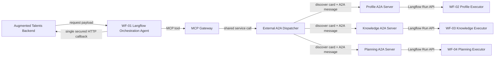

# Architecture

The three A2A servers are logical agents hosted by one FastAPI process. Each publishes a distinct Agent Card and A2A HTTP+JSON interface, owns a distinct task table, and delegates specialty reasoning to one Langflow flow.

## Responsibility boundary

| Component | Responsibility |
|---|---|
| Backend | Source request, business state, authorization context, idempotency authority, callback storage |
| Langflow Orchestrator | Operation classification, dependency planning, parallel/series selection, synthesis, final callback |
| MCP gateway | Typed, bearer-authenticated `dispatch_onboarding_agents` tool for WF-01 |
| External dispatcher | High-level tool for Langflow; performs actual A2A client behavior |
| A2A protocol server | Agent Cards, skill advertisement, messages, task lifecycle, artifacts, task storage, transport auth |
| Langflow Profile flow | Employee context, completeness, constraints |
| Langflow Knowledge flow | RAG, policies, requirements, citations |
| Langflow Planning flow | Generate, revise, adapt, explain plans |
